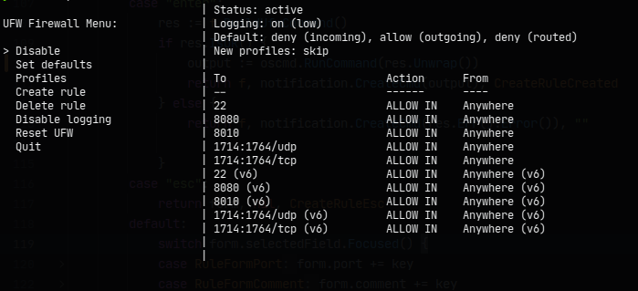

# 🔥 fwtui — Terminal UI for UFW (Uncomplicated Firewall)

`fwtui` is a terminal-based UI built in Go to help you manage UFW (Uncomplicated Firewall) rules with ease. No more memorizing complex command-line syntax — `fwtui` gives you a clean, responsive, and keyboard-driven interface to view and manage firewall rules directly from your terminal.



---

## ✨ Features

- **📋 Rule Management**
  - View all active UFW rules and default policies
  - Add custom rules with:
    - Specific ports and protocols
    - Traffic direction (in/out)
    - Interfaces, source/destination IPs
    - Comments for better organization
  - Delete rules easily using keyboard shortcuts
  - Export rules into a single executable script for backup or sharing

- **🛡️ Default Policies**
  - View and change default policies for incoming and outgoing traffic

- **📁 Profiles**
  - Create reusable rule profiles
  - Install predefined profiles in one click
  - List all available profiles for quick management

- **🔍 Advanced Views**
  - Show full raw UFW rules
  - View added rules only
  - Inspect built-in rules
  - View currently listening ports and services

- **💾 Automatic Backup**
  - UFW rules are automatically backed up at every app startup

- **⌨️ Full Keyboard Navigation**
  - No mouse needed — ideal for terminal lovers and remote server admins


---

## 🚀 Installation

The simplest way to install:

```bash
wget https://github.com/Beny406/fwtui/releases/latest/download/fwtui -O fwtui
chmod +x fwtui
```


## 🏃 Running

```bash
sudo ./fwtui
```
The app needs sudo because managing UFW firewall rules requires administrative privileges. Without it, the app can’t apply or modify system firewall settings.


## 🎮 Controls
| Key   | Action                        |
|-------|-------------------------------|
| ↑ / ↓ | Navigate fields and lists     |
| ← / → | Change selection in dropdowns |
| Type  | Edit text fields              |
| Enter | Submit or apply changes       |
| Esc   | Cancel or go back             |
| d     | Delete selected rule or item  |
| space | Select item                   |
